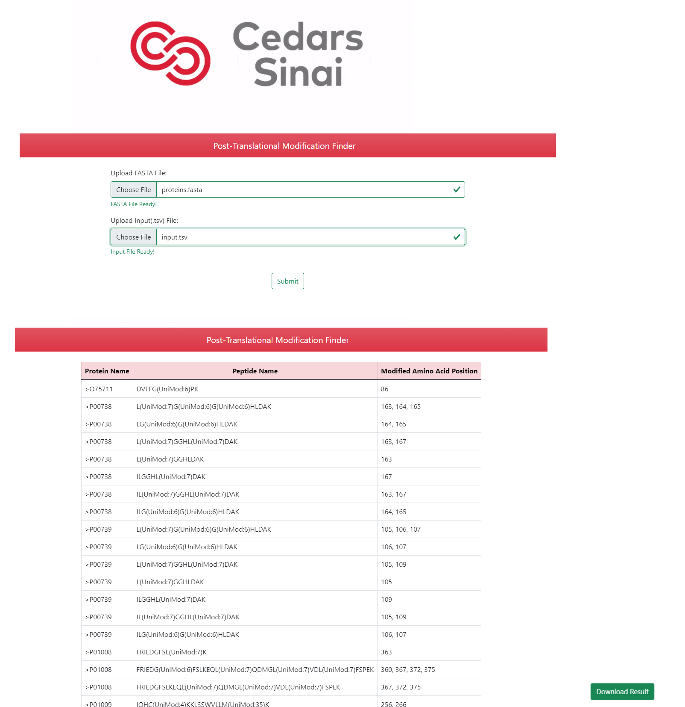

# Post-Translational Modification Finder

Proteins are fundamental components of cells that carry out important biological function. They are long molecules made up of multiple shorter peptide fragments which are in turn composed of short chain of amino acids. Amino acids can often get modified by post-translational modifications (PTMs) that are important in regulating cellular activity.  

This simple web application is programmed to find the position of PTMs across the full protein sequence by providing

1. FASTA file (list of protein sequences)
2. TSV file (list of peptides)


and will output the following

1. Protein Name
2. Peptide Name
3. Modified Position

This application also provide the user to download a CSV file of the ouput result 


## Tech Stack

**Client:** HTML/CSS/JS **Libraries:** JQuery, Bootstrap, AnimateCSS

**Server:** Python FastAPI hosted in Heroku
    **Libraries:** pandas, numpy, re 


## API Reference

#### Landing Page

```http
  GET /
```

| Parameter | Type     | Description                |
| :-------- | :------- | :------------------------- |
| `url` | `url` | https://ptm-finder.herokuapp.com/ |

#### Upload Files for Analysis

```http
  POST /uploadFiles/
```

| Parameter | Type     | Description                       |
| :-------- | :------- | :-------------------------------- |
| `file name`      | `file` | **Required**. FASTA File |
| `file name`|`file`|**Required**. TSV Input File|


## Screenshots



## Deployment

To run this project, visit the following URL and provide the necessary files

```bash
  https://ptm-finder.herokuapp.com/
```
You can view the source code under this GitHub URL:

```bash
   https://github.com/leolai2010/ptm_finder
```
